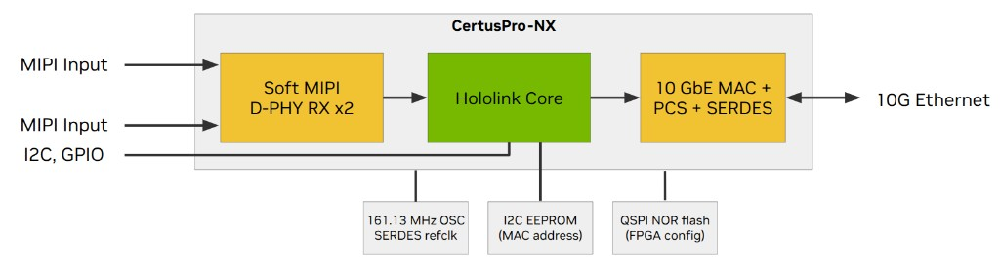

For developers and sensor module manufacturers focused on building HSB-compatible
cameras, radars or other MIPI/GMSL-interfaced sensors, the open-source MIPI CPNX
Reference Design is a great launchpad for your project. The FPGA reference design
features:

- One or two MIPI interfaces
- Dedicated I2C interfaces for sensor, I2C EEPROM, and auxiliary use.

This design targets the
[Lattice Semiconductor CertusPro-NX](https://www.latticesemi.com/en/Products/FPGAandCPLD/CertusPro-NX).

## Design Overview



*Figure 1. MIPI CPNX Reference Design hardware / FPGA IP block diagram*

The MIPI CPNX Reference Design centers on a **CertusPro-NX FPGA** that receives one or
two MIPI CSI-2 camera inputs, processes the sensor data through the Holoscan Sensor
Bridge IP, and exchanges data with a host over a 10 GbE link. The FPGA bitstream
contains three main functional blocks:

1. **Soft MIPI D-PHY RX ×2** — receives up to two independent 4-lane MIPI CSI-2 inputs
   using Lattice soft D-PHY IP.
1. **Hololink Core** — the Holoscan Sensor Bridge IP; packetizes sensor data, handles
   control-plane traffic, and manages peripheral interfaces (I2C, GPIO).
1. **10 GbE MAC + PCS + SERDES** — provides the bidirectional 10 GbE host interface for
   sensor data egress and control-plane traffic.

The block diagram above shows the FPGA internals and the external hardware connections
required by the design.

**FPGA inputs and outputs**

- **MIPI Inputs** (×2) — 4-lane MIPI CSI-2 camera interfaces (Ports 0 and 1).
- **I2C, GPIO** — control and general-purpose I/O routed to the Hololink Core for sensor
  configuration and board-level control.
- **10G Ethernet** — bidirectional high-speed link to the host over an SFP+ interface.

See **Suggested BOM** below for the required external components and suggested part
numbers.

## Reprogramming the lane count and clock rate

If you wish to use the design with 1- or 2-lane sensors, or use a different clock range,
you can reprogram the MIPI Soft DPHY registers from Python or C++ without modifying the
FPGA bitfile. Here is an example Python function to do this:

```python
def program_soft_mipi_phy(camera_idx, num_lanes, clock_freq):
    base_addr = 0x4000_0000

    lane_prog = num_lanes - 1

    if clock_freq >= 1000:
        data_lane_settle_cycle = 6
    elif clock_freq >= 350:
        data_lane_settle_cycle = 7
    elif clock_freq >= 200:
        data_lane_settle_cycle = 8
    elif clock_freq >= 150:
        data_lane_settle_cycle = 9
    else:
        data_lane_settle_cycle = 11

    reg28 = (lane_prog << 1)
    regD8 = (data_lane_settle_cycle)

    hololink.write_uint32(base_addr + 0x28 + (camera_idx * 0x1000_0000), reg28)
    hololink.write_uint32(base_addr + 0xD8 + (camera_idx * 0x1000_0000), regD8)
```

## Source Files

The FPGA source code for the project is located in the Holoscan Sensor Bridge repository
at `fpga/nv_mipi_ref_design/mipi_cpnx_ref_design`. The pre-built bitfile is located
[here](https://edge.urm.nvidia.com/artifactory/sw-holoscan-thirdparty-generic-local/hsb/fpga_ip/2606/mipi_ref_design/).

## Reference Hardware

You can use the MIPI CPNX Reference Design on supported hardware. The current hardware
platforms that supports this design include the
[Tauro Technologies DA326 Holoscan GMSL adapter](https://taurotech.com/products/nvidia-holoscan/da326-holoscan/).

We have several examples that illustrate the DA326 connected to a
[Leopard Imaging Hawk camera](https://leopardimaging.com/leopard-imaging-hawk-stereo-cameras/)
in the repository's `examples` directory; these have the name "hawk" in them. These can
be modified to support different GMSL2 cameras or raw MIPI sensors with your own
hardware.

## Custom Hardware

Developers can use this design (including the prebuilt bitfile) in custom hardware
designs built around the Lattice Semiconductor CertusPro-NX device. Consult Lattice
documentation (especially the
[CertusPro-NX Hardware Checklist](https://www.latticesemi.com/view_document?document_id=53255))
when working with the part — paying special attention to the power topology for the
SERDES block.

To ensure 100% bitfile compatibility with your reference design, please use the
following design constraints when designing your PCB.

### Suggested BOM

The following external components are required for a bitfile-compatible implementation
of this reference design.

| Component                                      | Suggested part      | Function                                                                |
| ---------------------------------------------- | ------------------- | ----------------------------------------------------------------------- |
| FPGA                                           | LFCPNX-100-9CBG256I | CertusPro-NX (100K LE, CBG256, speed grade 9); main programmable device |
| 161.13 MHz oscillator                          | NX33G1101Z          | 10 GbE SERDES reference clock and primary FPGA datapath clocks          |
| I2C EEPROM                                     | AT24C02             | Stores Ethernet MAC address and board enumeration data                  |
| QSPI NOR flash                                 | MT25QL256           | Stores the FPGA configuration bitstream                                 |
| SFP+ module, stand-alone PHY, or direct-attach | —                   | 10 GbE host interface to the sensor bridge                              |

Equivalent parts may be substituted provided they meet the electrical and timing
requirements described in the pin tables below.

### Banks and Voltage Rails

| Bank | VCCIO | I/O standard          | Notes                                                   |
| ---- | ----- | --------------------- | ------------------------------------------------------- |
| 0    | 3.3 V | LVCMOS33              | QSPI config flash, config pins                          |
| 1    | 3.3 V | LVCMOS33              | Control I2C, GPIO, sensor control, **SFP_TX_DIS**, JTAG |
| 2    | 3.3 V | LVCMOS33              | GPIO                                                    |
| 3    | 1.2 V | MIPI_DPHY / LVCMOS12H | MIPI CSI-2 Port 1                                       |
| 5    | 1.2 V | MIPI_DPHY / LVCMOS12H | MIPI CSI-2 Port 0                                       |
| 6    | 3.3 V | LVCMOS33              | GPIO                                                    |
| 7    | 3.3 V | LVCMOS33              | Camera I2C, auxiliary/PoC I2C, power control            |
| 80   | 1.0 V | SERDES                | 10 GbE transceiver (TX / RX / refclk).                  |

### 10 GbE host interface

| Signal         | Pin P | Pin N | I/O type                 | Dir | Function                                             |
| -------------- | ----- | ----- | ------------------------ | --- | ---------------------------------------------------- |
| **ETH_TXD**    | A9    | A8    | SERDES (HSO)             | Out | 10 GbE SERDES transmit → SFP+                        |
| **ETH_RXD**    | C8    | B7    | SERDES (HSI)             | In  | 10 GbE SERDES receive ← SFP+                         |
| **ETH_REFCLK** | D10   | E10   | SERDES refclk (HSI)      | In  | 161.1328125 MHz reference clock, supplied externally |
| **SFP_TX_DIS** | F9    | —     | LVCMOS33 (bank 1, 3.3 V) | Out | SFP+ transmit disable                                |

### MIPI CSI-2 receive — Port 0

| Signal               | Pin P | Pin N | Function    |
| -------------------- | ----- | ----- | ----------- |
| **MIPI_CAM_CLK[0]**  | L12   | K12   | Clock lane  |
| **MIPI_CAM_DATA[0]** | K13   | L13   | Data lane 0 |
| **MIPI_CAM_DATA[1]** | K11   | L11   | Data lane 1 |
| **MIPI_CAM_DATA[2]** | L14   | K14   | Data lane 2 |
| **MIPI_CAM_DATA[3]** | K16   | L16   | Data lane 3 |

### MIPI CSI-2 receive — Port 1

| Signal               | Pin P | Pin N | Function    |
| -------------------- | ----- | ----- | ----------- |
| **MIPI_CAM_CLK[1]**  | L3    | L2    | Clock lane  |
| **MIPI_CAM_DATA[4]** | L4    | M4    | Data lane 0 |
| **MIPI_CAM_DATA[5]** | M2    | M1    | Data lane 1 |
| **MIPI_CAM_DATA[6]** | N2    | P2    | Data lane 2 |
| **MIPI_CAM_DATA[7]** | P1    | N1    | Data lane 3 |

### Sensor & power control

| Signal       | Pin | Bank | Dir | Function                               |
| ------------ | --- | ---- | --- | -------------------------------------- |
| **CAM_RST**  | H4  | 1    | Out | Sensor reset / power-down (active low) |
| **CAM_MCLK** | H3  | 1    | Out | Sensor reference clock (27 MHz)        |

### I2C buses

| Signal         | Pin SCL | Pin SDA | Bank | Function                                      |
| -------------- | ------- | ------- | ---- | --------------------------------------------- |
| **CTRL_I2C**   | H6      | H7      | 1    | Control I2C (bus 0) — management / ID EEPROM  |
| **CAM_I2C[0]** | H10     | H9      | 7    | Camera / sensor I2C (bus 1)                   |
| **I2C_POC**    | E15     | E14     | 7    | Auxiliary I2C (bus 2) — e.g. PoC power switch |

### QSPI configuration flash

| Signal                | Pin | Dir | Function                 |
| --------------------- | --- | --- | ------------------------ |
| **FLASH_SPI_MCSN**    | E5  | Out | Chip select (active low) |
| **FLASH_SPI_MSCK**    | E7  | Out | Clock                    |
| **FLASH_SPI_SDIO[0]** | D5  | I/O | Data 0                   |
| **FLASH_SPI_SDIO[1]** | C2  | I/O | Data 1                   |
| **FLASH_SPI_SDIO[2]** | C1  | I/O | Data 2                   |
| **FLASH_SPI_SDIO[3]** | D4  | I/O | Data 3                   |

### GPIO

These GPIO signals can be direction runtime-configurable and used for any application;
defaults shown below:

| Signal       | Pin | Bank | Default dir |
| ------------ | --- | ---- | ----------- |
| **GPIO[0]**  | F3  | 1    | Out         |
| **GPIO[1]**  | F2  | 1    | In          |
| **GPIO[2]**  | H2  | 1    | Out         |
| **GPIO[3]**  | G5  | 1    | Out         |
| **GPIO[4]**  | G6  | 1    | In          |
| **GPIO[5]**  | F7  | 1    | Out         |
| **GPIO[6]**  | J8  | 6    | Out         |
| **GPIO[7]**  | E6  | 1    | Out         |
| **GPIO[8]**  | J9  | 6    | Out         |
| **GPIO[9]**  | J4  | 2    | Out         |
| **GPIO[10]** | J3  | 2    | Out         |

**Note:** on the Tauro Technologies DA326, **GPIO[0]** is used as the enable signal for
the PoC controller, and **GPIO[1]** is used as the INT signal for this chip.

### Clock & configuration

| Signal       | Pin | Bank | Dir | Function                        |
| ------------ | --- | ---- | --- | ------------------------------- |
| **RESET_N**  | H1  | 1    | In  | Reset (active low, pulled high) |
| **PROGRAMN** | C3  | 0    | In  | Program (active low)            |
| **INITN**    | C4  | 0    | I/O | Init (active low, open-drain)   |
| **DONE**     | D7  | 0    | Out | Configuration done              |
| **JTAG_EN**  | D6  | 1    | In  | JTAG enable                     |
| **TCK**      | E2  | 1    | In  | JTAG clock                      |
| **TMS**      | G7  | 1    | In  | JTAG mode select                |
| **TDI**      | F5  | 1    | In  | JTAG data in                    |
| **TDO**      | F4  | 1    | Out | JTAG data out                   |
