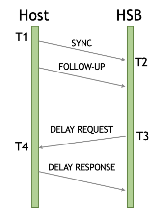
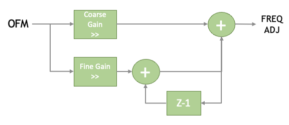
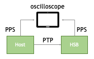
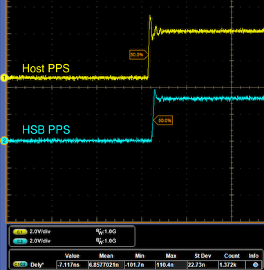
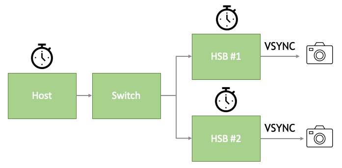
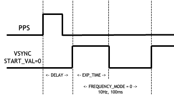

The Holoscan Sensor Bridge (HSB) IP supports Precision Time Protocol (PTP) version 2 per
IEEE1588-2019 specification.

PTP synchronizes the host time to all downstream devices. To enable the host as the Time
Transmitter and send PTP packets, refer to the
[Host Setup](sensor_bridge_hardware_setup.mdx) page.

The HSB IP's PTP instantiation can be removed by defining `EXT_PTP` (meaning External
PTP) in the "HOLOLINK_def.svh". Defining `EXT_PTP` will expose different I/Os to the HSB
IP to input the external PTP timestamp to HSB IP. Refer to
[Port Description](port_description.mdx) for more information. Important note is that
"i_pps" port needs to be toggled once a second when `EXT_PTP` is defined. Enumeration
with host happens through BOOTP messages which is triggered by PPS.

## Use Case

ß Synchronized PTP time can be used to:

1. Timestamp specific Sensor Interface and Host Interface events. Refer to
   [Metadata Packet](dataplane.mdx#metadata-packet) for PTP timestamp events transmitted
   to the host.
1. Synchronize multiple HSBs on the network.
1. In camera application, a synchronized Vertical SYNC (VSYNC) strobe can align the
   start of exposure across multiple cameras on the network. For more information, refer
   to [VSYNC](ptp_app_note.mdx#vsync)

## Profile

HSB IP supports the following PTP profiles

1. 1588 profile with End to End Delay Mechanism (default)
1. gPTP profile with Peer to Peer Delay Mechanism
1. 1588 profile with Peer to Peer Delay Mechanism

HSB IP PTP implementation is limited to:

1. Operate as PTP Receiver only
1. Transmit and Receive PTP messages over Ethernet L2 Layer only.
1. Does not support Announce messages.
1. Does not support Best Master Clock Algorithm. It assumes there is only 1 master in
   the network at a given time.
1. PTP traffic can only occur on HSB IP Host Interface 0.

## PTP Flow

### PTP Message and Timestamps

1. Timestamp 1 (T1) Host broadcasts it's current time by sending SYNC and FOLLOW-UP (in
   2-step mode) messages.
1. Timestamp 2 (T2) HSB stamps it's current time when it received the SYNC message.
1. Timestamp 3 (T3) HSB sends Delay Request message upon receiving SYNC/FOLLOW-UP
   message. (For End to End Delay Mechanism)
1. Timestamp 4 (T4) Host stamps it's current time upon receiving the Delay Request
   message and sends a Delay Response message.

With 4 timestamps available, HSB IP can calculate the Offset Measurement (OFM) and Mean
Delay.

Peer to Peer delay mechanism has different PTP messages and timing but it's concept of
mean delay measurement is similar.

PTP message flow with End to End delay mechanism is shown below.



### PTP Timer

PTP module runs in "i_ptp_clk" domain. "i_ptp_clk" can be asynchronous to the
"i_hif_clk" domain but for best performance, generate the clock derived from the
recovered Ethernet PCS or MAC clock. Recommended PTP clock frequency is from 95MHz to
105MHz.

PTP Timer sequence:

1. Following reset, timer begins at 0 seconds and 0 nanoseconds. At each rising clock
   edge, the timer increments by (1/`PTP_CLK_FREQ`) nanoseconds and 24-bit fractional
   nanoseconds, where `PTP_CLK_FREQ` is a parameter defined in "HOLOLINK_def.svh" For
   example in 10G application, `PTP_CLK_FREQ=100446545` derived from recovered Ethernet
   PCS clock and the incremental value per rising clock edge is 9.955ns.
1. When PTP is enabled, the HSB IP latches the Host Timestamp (T1) as it's current time
   and the timer and continues to increment as before. This allows the timer to catch up
   to the current PTP time.
1. In subsequent SYNC messages, uses the timestamps (T1-T4) to calculate the Offset
   Measurement (OFM) and adjust the timer's incremental value. Adjusting the incremental
   value (inverse of frequency) compensates for on-board oscillator drift and
   temperature variation.

### Offset Measurement

Offset Measurement (OFM) is the time offset between host time and HSB IP time. When the
Host time (T1) arrives at HSB IP, the timestamp is outdated by factors such as mean
delay, switch residence time, and delay asymmetry. Adjusting the OFM for the various
delays calculates a more accurate offset for more accurate synchronization.

- Mean Delay
  - Mean Delay is defined as the average network delay from Host to HSB and from HSB to
    Host. Mean Delay samples are further averaged in a moving window to smooth outlier
    values.
- Switch Residence Time
  - The network connection between Host and HSB can be a direct connection or through
    numerous switches to aggregate multiple HSB into a single host. Each switches in the
    network adds residence time, or time it takes for the PTP message to traverse
    through the switch. This residence time is appended to the PTP message in the
    Correction Field.
- Delay Asymmetry
  - Delay Asymmetry is defined as the time difference between the Ingress and Egress of
    Ethernet packets. The delay asymmetry within HSB IP is automatically calculated.
    `HOST_WIDTH` parameter can affect the number of clock cycles it takes to consume the
    PTP message which adds to the Ingress delay.
  - There is also the delay asymmetry outside of the HSB IP in the FPGA vendor Ethernet
    MAC and PCS IP. This is vendor specific and is programmable using the PTP Delay
    Asymmetry register.

### Frequency Adjustment Digital PLL (DPLL)

The Offset Measurement (OFM) feeds the Digital PLL (DPLL), which produces a frequency
adjustment value. In the timer, that adjustment is applied as a correction to the
per-clock increment so the closed loop tracks host time. Coarse Gain and Fine Gain are
programmable registers: each scales OFM by an arithmetic right shift.



## Registers

Below lists the configurable PTP registers.

| **Reg Name**          | **Reg Addr** | **Reg Value Range**     | **Default Value** | **Notes**                                                                  |
| --------------------- | ------------ | ----------------------- | ----------------- | -------------------------------------------------------------------------- |
| Gain Enable           | 0x00000104   | 0x0 - 0x3               | 0x3               | Enable Frequency Adjustment Gain. [0]=Coarse Gain, [1]=Fine Gain           |
| PTP Profile           | 0x00000108   | 0x0 - 0x2               | 0x0               | PTP Profiles. [0]=1588 E2E, [1]=gPTP, [2]=1588 P2P                         |
| Delay Asymmetry       | 0x0000010C   | 0x00000000 - 0xFFFFFFFF | 0x33              | Ingress Asymmetry in 2's complement. Unit is in nanoseconds.               |
| Coarse Gain           | 0x00000110   | 0x0 - 0xF               | 0x2               | Frequency Adjustment Coarse Gain                                           |
| Fine Gain             | 0x00000114   | 0x0 - 0xF               | 0x2               | Frequency Adjustment Fine Gain                                             |
| Mean Delay Avg Factor | 0x00000118   | 0x0 - 0x3               | 0x3               | Averages by factor of 2. So 0x1 = 2 samples, 0x2 = 4 samples, etc          |
| PTP Domain            | 0x0000011C   | 0x0 - 0xFF              | 0x0               | PTP Domain Number. PTP messages not matching the Domain Number is ignored. |

Below lists the Status PTP Registers.

| **Reg Name**          | **Reg Addr** | **Notes**                                                                                                                                               |
| --------------------- | ------------ | ------------------------------------------------------------------------------------------------------------------------------------------------------- |
| SYNC Timestamp        | 0x00000180   | Received PTP SYNC Timestamp value                                                                                                                       |
| SYNC Correction Field | 0x00000184   | Received PTP SYNC Correction Field value                                                                                                                |
| PTP Status            | 0x00000188   | Status. [0]=SYNC msg received. [1]=SYNC msg received and PTP enabled. [2]=Delay Response msg received. [3]=Delay Response msg received and PTP enabled. |
| OFM                   | 0x0000018C   | Calculated Offset Measurement value                                                                                                                     |
| Mean Delay            | 0x00000190   | Calculated Mean Delay value                                                                                                                             |
| Increment Period      | 0x00000194   | Current incremental value per period. [31:24] nanoseconds [23:0] Fractional nanoseconds                                                                 |
| Frequency Adjustment  | 0x00000198   | Calculated Frequency Adjustment value                                                                                                                   |

An example python script to reconfigure PTP is shown below. The values used in the
example are the default configuration after reset.

```python
  def ptp_enable(hololink)
    hololink.write_uint32(0x00000108, 0x00000000)  # PTP Profile
    hololink.write_uint32(0x0000010C, 0x00000033)  # Delay Asymmetry
    hololink.write_uint32(0x00000110, 0x00000002)  # DPLL CFG 1
    hololink.write_uint32(0x00000114, 0x00000002)  # DPLL CFG 2
    hololink.write_uint32(0x00000118, 0x00000003)  # Mean Delay
    hololink.write_uint32(0x00000104, 0x00000003)  # Enable DPLL
```

## Performance

The performance of the PTP was tested by comparing the Pulse Per Second (PPS) between
the host and the HSB IP on oscilloscope.



The performance test was done with the following configuration.

| **Parameter or Reg**   | **Value**        |
| ---------------------- | ---------------- |
| (Host) logSyncInterval | -3 (8 times/sec) |
| HIF_CLK_FREQ           | 156250000Hz      |
| PTP_CLK_FREQ           | 100446545Hz      |
| Gain Enable            | 0x3              |
| Delay Asymmetry        | 0x33             |
| Coarse Gain            | 0x2              |
| Fine Gain              | 0x2              |
| Mean Delay Avg Factor  | 0x3              |

Oscilloscope capture of the PPS measurement is shown below.



| **Offset** | **End to End Standard Deviation** |
| ---------- | --------------------------------- |
| \<10 ns    | < 25 ns                           |

## Debug

- PTP Status [0] = 0, [1] = 0
  - SYNC/FOLLOW-UP message not received.
    - Check on Wireshark if host is transmitting PTP messages.
    - If host is transmitting PTP messages but HSB is not transmitting any PTP messages,
      check the MajorSdoID field of the host PTP packet.
      - For 1588 profile, MajorSdoID should be 0.
      - For gPTP profile, MajorSdoID should be 1.
- PTP Status [0] = 1, [1] = 0
  - SYNC/FOLLOW-UP message received but HSB IP PTP is not enabled.
- PTP Status [0] = 1, [1] = 1
  - PTP is enabled and successfully received PTP messages.
- OFM
  - Read OFM register in quick succession. If the Frequency Adjustment DPLL is stable,
    OFM should stabilize near 0 between -100 and +100. If the OFM is oscillating and
    magnitude is growing, the DPLL could be unstable, increase the Coarse Gain and Fine
    Gain registers.

## VSYNC

In camera application, Vertical SYNC (VSYNC) or sometimes referred to as Frame SYNC
(FSYNC), controls the start of camera exposure for that frame. Multiple cameras
connected across multiple HSBs can be synchronized to a single host via PTP. From
synchronized PTP time, VSYNC can be generated to synchronize the start of frame capture.



## VSYNC RTL Integration

Reference design "vsync_gen" RTL module can generate VSYNC strobes based on the current
timestamp. Ports of the "vsync_gen" module are listed below.

| **Signal Name**     | **Direction** | **Description**                            |
| ------------------- | ------------- | ------------------------------------------ |
| i_clk               | Input         | PTP Clock                                  |
| i_rst               | Input         | PTP Reset, sync to PTP clock domain        |
| i_pps               | Input         | Pulse Per Second, PTP clock domain         |
| i_ptp_nanosec[31:0] | Input         | PTP nanosecond timestamp, PTP clock domain |
| o_vsync_strb        | Output        | VSYNC strobe, PTP clock domain             |
| o_gpio_mux[9:0]     | Output        | GPIO MUX Enable signal, PTP clock domain   |
| i_apb_clk           | Input         | APB Clock                                  |
| i_apb_rst           | Input         | APB Reset, APB clock domain                |
| i_apb_sel           | Input         | APB select                                 |
| i_apb_enable        | Input         | APB Enable                                 |
| i_apb_addr[31:0]    | Input         | APB Address                                |
| i_apb_wdata[31:0]   | Input         | APB Write Data                             |
| i_apb_write         | Input         | APB Write                                  |
| o_apb_ready         | Output        | APB Ready                                  |
| o_apb_rdata[31:0]   | Output        | APB Read Data                              |
| o_apb_serr          | Output        | APB Completer Error                        |

The "vsync_gen" module can be instantiated at the same wrapper module of the HSB IP
where the APB signals connect to the HSB IP APB signals. The base address of the VSYNC
module will depend on which bit of the HSB IP's "o_apb_psel" port is connected. Refer to
[Register Interface](register_interface.mdx) page for more information. In the Lattice
CPNX100-ETH-SENSOR-BRIDGE reference design, "vsync_gen" module is connected to HSB IP's
"o_apb_psel[6]" which maps to 0x7000_0000 base address.

## VSYNC Register Configuration

| **Reg Name**    | **Reg Add Offset** | **Reg Value Range** | **Notes**                                            |
| --------------- | ------------------ | ------------------- | ---------------------------------------------------- |
| Enable          | 0x0000             | 0x0 - 0x1           | 0=Disabled, 1=Enabled                                |
| Frequency Mode  | 0x0004             | 0x0 - 0x3           | 0=10Hz, 1=30Hz, 2=60Hz, 3=90Hz, 4=120Hz              |
| Delay           | 0x0008             | 0x0 - 0xFFFFFFFF    | Delay in ns before starting VSYNC assertion          |
| Start Val       | 0x000C             | 0x0 - 0x1           | Starting state of VSYNC. 0=Active High, 1=Active Low |
| Exposure Time   | 0x0010             | 0x0 - 0xFFFFFFFF    | Active state in ns                                   |
| GPIO MUX Enable | 0x0014             | 0x0 - 0x3FF         | GPIO MUX control signals                             |



1. Configure Frequency mode, Delay, Start Val, and Exposure time.
   1. Delay and Exposure time should be set to a value less than the period of the
      configured frequency.
   1. Some cameras use the active state (Exposure Time register) of VSYNC signal as the
      exposure time of the camera.
1. Enable VSYNC
   1. Once enabled, VSYNC is generated at the start of next Pulse Per Second (PPS)
      signal.

## GPIO MUX Enable

GPIO MUX Enable register is used to force route the VSYNC signal to an existing GPIO.
When routing the VSYNC signal to a tri-state HSB GPIO, tri-state should be the final
assignment to ensure the synthesis tool places the GPIO to an INOUT buffer. Example code
to route VSYNC signal onto tri-state GPIO:

```none
assign i_gpio[14] = GPIO[14];
assign GPIO[14] = o_gpio_dir[14] ? 1'bz : o_gpio_mux_en[1] ? o_vsync_strb : o_gpio[14];
```

In Lattice CPNX100-ETH-SENSOR-BRIDGE reference design, PPS and VSYNC signals is muxed
out to few GPIOs. Bits to force PPS and VSYNC signals are listed below.

| **GPIO MUX Enable Bit** | **Signal** | **HSB GPIO** | **Hardware Pin** |
| ----------------------- | ---------- | ------------ | ---------------- |
| [0]                     | PPS        | GPIO[15]     | J20, pin18       |
| [1]                     | VSYNC      | GPIO[14]     | J20, pin16       |
| [3:2]                   | reserved   | reserved     | reserved         |
| [4]                     | VSYNC      | GPIO[19]     | J9, pin85        |
| [5]                     | VSYNC      | GPIO[22]     | J9, pin96        |
| [6]                     | VSYNC      | GPIO[23]     | J9, pin97        |
| [7]                     | VSYNC      | GPIO[24]     | J9, pin98        |
| [9:8]                   | reserved   | reserved     | reserved         |
