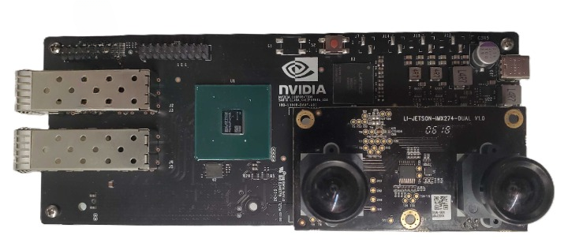
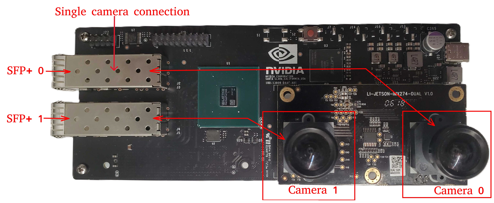

# Holoscan Sensor Bridge Device Setup

Here are instructions to set up the Holoscan sensor bridge device and connect it to the
IGX and Jetson AGX Orin devkits.

## The Holoscan Sensor Bridge board

Holoscan sensor bridge has the following connectors:

1. **SFP+ ports** - Two 10Gbps Ethernet ports which connect to the host system.
1. **Camera connector** - This connector is used to interface with a camera (e.g.
   IMX274).
1. **Power port** - the sensor bridge device is powered by using a USB-C power supply
   with a minimum of 12V/2A connected to this port.
1. **GPIO pins** - the sensor bridge device supports 16 GPIO pins (0...15) and 4 ground
   pins (marked 'G' in the image above).

Note that the sensor bridge device does not provide a USB host interface: the USB-C
interface is used only for power. All host interaction is through the Ethernet ports.

Holoscan sensor bridge reference applications are currently using the IMX274 dual camera
module:

The camera module is mounted on the sensor bridge device in the following manner:

## Connecting Holoscan sensor bridge to the Host

1. Make sure the Hololoink board is powered off.

1. Mount the Camera module into the camera connector as shown in the above image.

1. Connect the SFP+ port marked "SFP+ 0" in the image below to the host system. This is
   the appropriate connection for accessing the first camera in a stereo camera pair.
   This port provides access to the data from the camera indicated by "Camera 0".

1. For IGX Devkit, connect to the QSFP port marked with red arrow in the image below.

   

   For configurations using the second camera in the stereo camera pair, connect the SFP
   port labelled "SFP+ 1" to the unconnected QSFP port on the back of IGX.

1. For AGX Orin Devkit, connect to the 10G Ethernet port (marked 'H' in the image
   below).

   

1. Connect a USB-C power supply with a minimum of 12V/2A to the USB-C power connector of
   the sensor bridge device and wait for the green leds on the sensor bridge board to
   light up.

1. Follow the instructions in the [setup page](setup.md) to configure your host system.
