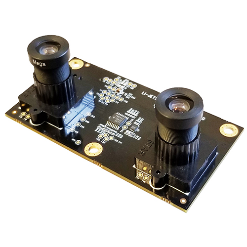
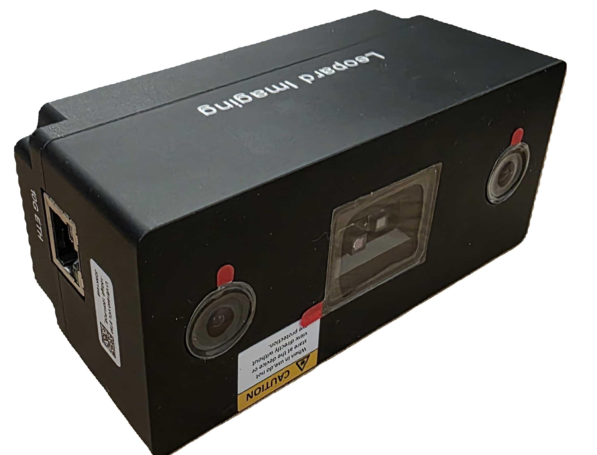

# Holoscan Sensor Bridge Device Setup

Here are instructions to set up the Holoscan sensor bridge device and connect it to the
IGX and Jetson AGX Orin devkits.

`````{tab-set}
````{tab-item} Lattice CPNX100-ETH-SENSOR-BRIDGE

## The Holoscan Sensor Bridge board


Lattice CPNX100-ETH-SENSOR-BRIDGE has the following connectors:

1. **SFP+ ports** - Two 10Gbps Ethernet ports which connect to the host system.
1. **Camera connector** - This connector is used to interface with a camera (e.g.
   IMX274).
1. **Power port** - the sensor bridge device is powered by using a USB-C power supply
   with input voltage from 5V to 20V. Since the sensors are powered through the
   sensor bridge board, it is recommended to use a dedicated power supply to power
   both the board and the sensors.
1. **GPIO pins** - the sensor bridge device supports 16 GPIO pins (0...15) and 4 ground
   pins (marked 'G' in the image above).

Note that the sensor bridge device does not provide a USB host interface: the USB-C
interface is used only for power. All host interaction is through the Ethernet ports.

Holoscan sensor bridge reference applications are currently using the IMX274 dual camera
module:



The camera module is mounted on the sensor bridge device in the following manner:


## Connecting Holoscan sensor bridge to the Host

1. Make sure the Holoscan sensor bridge board is powered off.

1. Mount the Camera module into the camera connector as shown in the above image.

1. Connect the SFP+ port marked "SFP+ 0" in the image below to the host system. This is
   the appropriate connection for accessing the first camera in a stereo camera pair.
   This port provides access to the data from the camera indicated by "Camera 0".


1. For IGX Devkit, connect to the QSFP port marked with red arrow in the image below.

   

   For configurations using the second camera in the stereo camera pair, connect the SFP
   port labelled "SFP+ 1" to the unconnected QSFP port on the back of IGX.

1. For AGX Orin Devkit, connect to the 10G Ethernet port (marked 'H' in the image
   below).

   

1. Connect a USB-C power supply with a minimum of 12V/2A to the USB-C power connector of
   the sensor bridge device and wait for the green LEDs on the sensor bridge board to
   light up.
4. For more details see the [Lattice CPNX100-ETH-SENSOR-BRIDGE](https://www.latticesemi.com/products/designsoftwareandip/intellectualproperty/referencedesigns/referencedesigns05/lattice-nvidia-edge-ai)

Follow the instructions in the [setup page](setup.md) to configure your host system.

````
````{tab-item} Microchip MPF200-ETH-SENSOR-BRIDGE
Here are instructions to set up the Microchip MPF200-ETH-SENSOR-BRIDGE device and connect it to the
IGX and Jetson AGX Orin devkits.

## The Holoscan Sensor Bridge board


Microchip MPF200-ETH-SENSOR-BRIDGE has the following connectors:

1. **SFP+ ports** - Two 10Gbps Ethernet ports which connect to the host system.
1. **Camera connector** - This connector is used to interface with a camera (e.g.
   IMX477).
1. **Power switch** - the sensor bridge device is powered by using a 12V power supply
   with a minimum of 12V/2A connected to this port.
   Follow the instructions in the [setup page](setup.md) to configure your host system.

   

Microchip MPF200-ETH-SENSOR-BRIDGE reference applications are currently using the [IMX477 camera](https://www.arducam.com/product/12-3mp-477m-hq-camera-module-with-135d-m12-wide-angle-lens-for-nvidia-jetson-nano-xavier-nx-and-orin-nx-agx-orin/)
module:


The camera module is mounted on the sensor bridge device in the following manner:


## Connecting Holoscan sensor bridge to the Host


1. Connect the SFP+ port to the host system as shown in the above image. 

2. For AGX Orin Devkit, connect to the 10G Ethernet port (marked 'H' in the image
   below).

   

3. Use the power switch to power up the board.

4. For more details see the [Microchip MPF200-ETH-SENSOR-BRIDGE](https://www.microchip.com/en-us/products/fpgas-and-plds/boards-and-kits/ethernet-sensor-bridge)

Follow the instructions in the [setup page](setup.md) to configure your host system.
````
````{tab-item} Leopard imaging VB1940 Eagle Camera
Here are instructions to set up the VB1940 Eagle camera and connect it directly to the
IGX and Jetson AGX Orin devkits.

## The VB1940 Eagle Camera

The Leopard imaging VB1940 Eagle camera is a Power Over Ethernet (POE) camera that connects directly
to the devkit without requiring a sensor bridge device. 
It features:

- **Direct Ethernet connection** - Connects directly to the host system using CAT-6 Ethernet cable
- **Industrial grade** - Designed for industrial, Robotics and medical applications
- **Compact design** - No additional bridge hardware required

   

## Connecting VB1940 Eagle Camera to the Host
Make sure your VB1940 is flashed with the latest firmware, see [Holoscan Sensor Bridge FPGA firmware update](sensor_bridge_firmware_setup.md) page for more details.
1. Connect the Ethernet cable from the VB1940 Eagle Camera to an available Ethernet port on your devkit

2. For IGX Devkit, use a QSFP adapter to connect to the QSFP Ethernet port marked with a red arrow on the back panel

   

3. For AGX Orin Devkit, connect to the 10G Ethernet port (marked 'H' in the image below)

   

4. Make sure the VB1940 Eagle camera is powered 

5. Verify connectivity by running `ping 192.168.0.2`

6. For more details, see the [Leopard imaging Eagle Camera documentation](https://leopardimaging.com)

Follow the instructions in the [setup page](setup.md) to configure your host system.
````
`````
