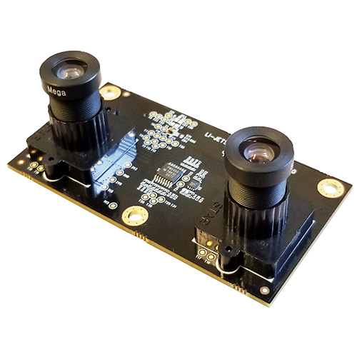
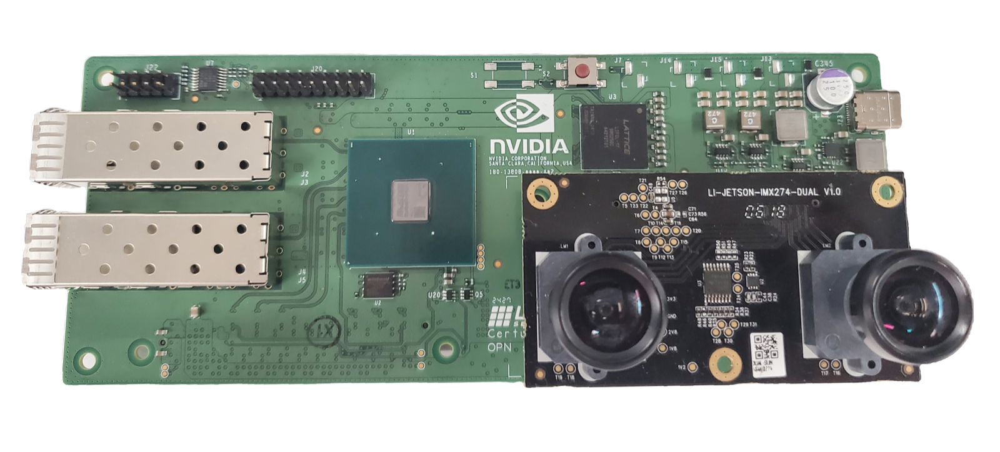
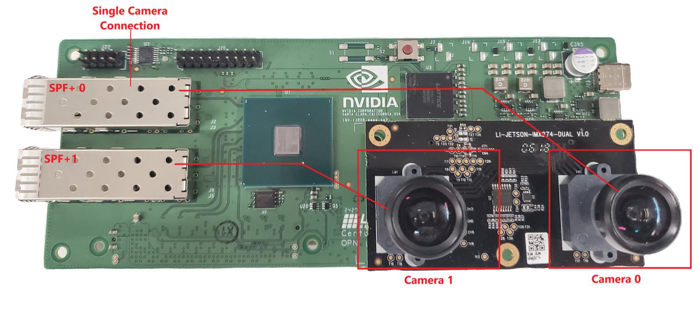
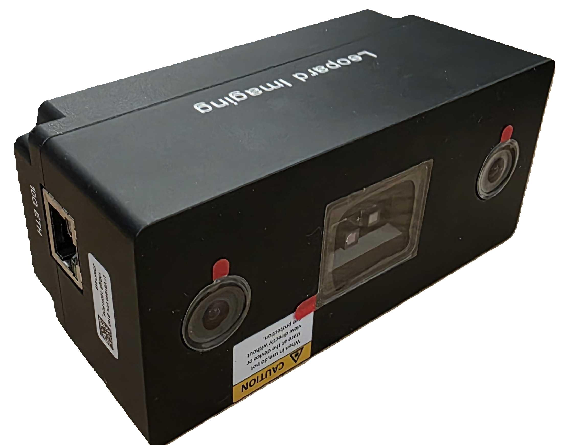
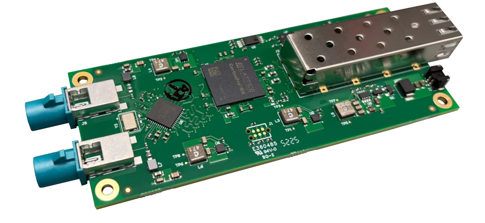
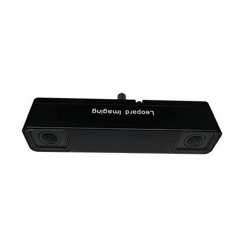
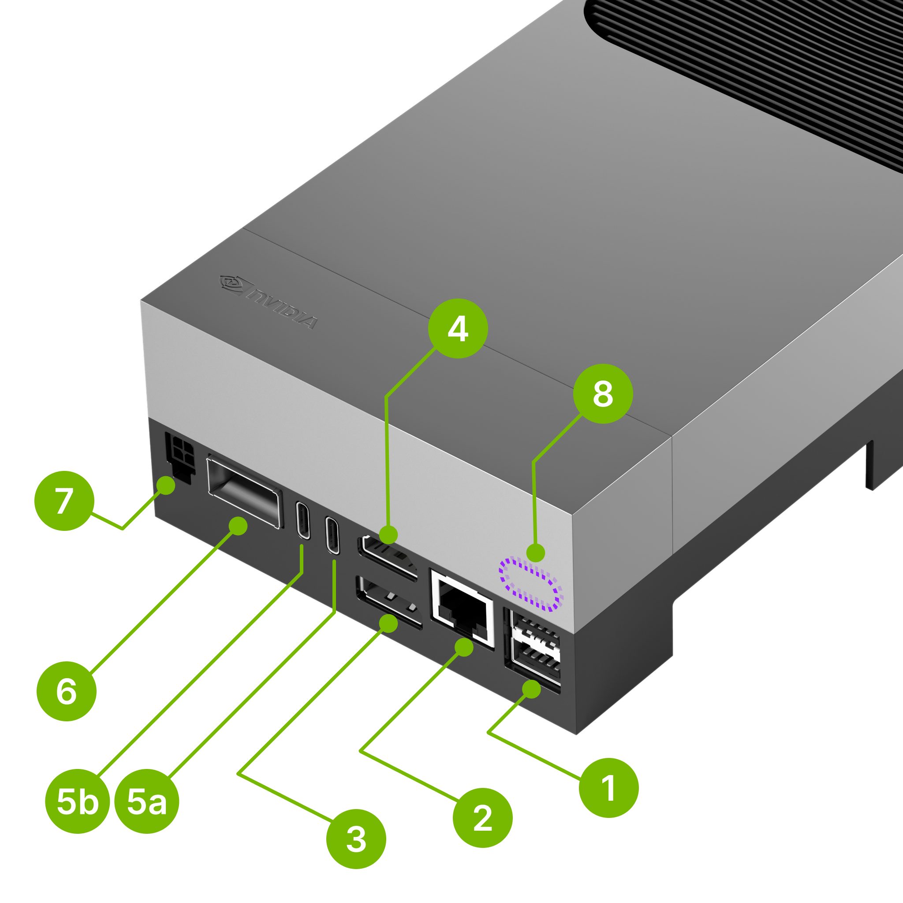

This page covers device setup for Holoscan Sensor Bridge dev kits that have built-in
support. For the comprehensive list of supported partner products, please visit the
[Holoscan Sensor Bridge homepage](https://www.nvidia.com/en-us/technologies/holoscan-sensor-bridge/).
Many vendors maintain Holoscan Sensor Bridge ports to their FPGAs, MCUs, and sensor
modules. Contact these vendors for instructions on how to use their products.

<Tabs>

<Tab title="Lattice CPNX100-ETH-SENSOR-BRIDGE">

## The Holoscan Sensor Bridge board

Lattice CPNX100-ETH-SENSOR-BRIDGE has the following connectors:

1. **SFP+ ports** - Two 10Gbps Ethernet ports which connect to the host system.
1. **Camera connector** - This connector is used to interface with a camera (e.g.
   IMX274).
1. **Power port** - the sensor bridge device is powered by using a USB-C power supply
   with input voltage from 5V to 20V. Since the sensors are powered through the sensor
   bridge board, it is recommended to use a dedicated power supply to power both the
   board and the sensors.
1. **GPIO pins** - the sensor bridge device supports 16 GPIO pins (0...15) and 4 ground
   pins (marked 'G' in the image above).

Note that the sensor bridge device does not provide a USB host interface: the USB-C
interface is used only for power. All host interaction is through the Ethernet ports.

Holoscan sensor bridge reference applications are currently using the IMX274 dual camera
module:

The camera module is mounted on the sensor bridge device in the following manner:

### Connecting Holoscan sensor bridge to the Host

1. Make sure the Holoscan sensor bridge board is powered off.

1. Mount the Camera module into the camera connector as shown in the above image.

1. Connect the SFP+ port marked "SFP+ 0" in the image below to the host system. This is
   the appropriate connection for accessing the first camera in a stereo camera pair.
   This port provides access to the data from the camera indicated by "Camera 0".

1. For IGX Devkit, connect to the QSFP port marked with red arrow in the image below.

For configurations using the second camera in the stereo camera pair, connect the SFP
port labelled "SFP+ 1" to the unconnected QSFP port on the back of IGX.

1. For DGX Spark, connect the "SFP+ 0" port on the HSB to the "CX7 QSFP port 0" shown
   below. For configurations using the second camera in the stereo camera pair, connect
   the "SFP+ 1" port on the HSB to the "CX7 QSFP port 1".

1. For AGX Orin Devkit, connect to the 10G Ethernet port (marked 'H' in the image
   below).

1. Connect a USB-C power supply with a minimum of 12V/2A to the USB-C power connector of
   the sensor bridge device and wait for the green LEDs on the sensor bridge board to
   light up.

1. For more details see the
   [Lattice CPNX100-ETH-SENSOR-BRIDGE](https://www.latticesemi.com/products/designsoftwareandip/intellectualproperty/referencedesigns/referencedesigns05/lattice-nvidia-edge-ai)

Follow the instructions in the [setup page](setup.mdx) to configure your host system.

</Tab>
<Tab title="Microchip MPF200-ETH-SENSOR-BRIDGE">

Here are instructions to set up the Microchip MPF200-ETH-SENSOR-BRIDGE device and
connect it to the IGX and Jetson AGX Orin devkits.

## The Holoscan Sensor Bridge board

Microchip MPF200-ETH-SENSOR-BRIDGE has the following connectors:

1. **SFP+ ports** - Two 10Gbps Ethernet ports which connect to the host system.
1. **Camera connector** - This connector is used to interface with a camera (e.g.
   IMX477).
1. **Power switch** - the sensor bridge device is powered by using a 12V power supply
   with a minimum of 12V/2A connected to this port. Follow the instructions in the
   [setup page](setup.mdx) to configure your host system.

Microchip MPF200-ETH-SENSOR-BRIDGE reference applications are currently using the
[IMX477 camera](https://www.arducam.com/product/12-3mp-477m-hq-camera-module-with-135d-m12-wide-angle-lens-for-nvidia-jetson-nano-xavier-nx-and-orin-nx-agx-orin/)
module:

The camera module is mounted on the sensor bridge device in the following manner:

#### Connecting Holoscan sensor bridge to the Host

1. Connect the SFP+ port to the host system as shown in the above image.

1. For AGX Orin Devkit, connect to the 10G Ethernet port (marked 'H' in the image
   below).

1. Use the power switch to power up the board.

1. For more details see the
   [Microchip MPF200-ETH-SENSOR-BRIDGE](https://www.microchip.com/en-us/products/fpgas-and-plds/boards-and-kits/ethernet-sensor-bridge)

Follow the instructions in the [setup page](setup.mdx) to configure your host system.

</Tab>
<Tab title="Leopard imaging VB1940 Eagle Camera">

Here are instructions to set up the VB1940 Eagle camera and connect it directly to the
IGX and Jetson AGX Orin devkits.

## Leopard imaging VB1940 Eagle Camera

The Leopard imaging VB1940 Eagle camera is a Power Over Ethernet (POE) camera that
connects directly to the devkit without requiring a sensor bridge device. It features:

- **Direct Ethernet connection** - Connects directly to the host system using CAT-6
  Ethernet cable

- **Industrial grade** - Designed for industrial, Robotics and medical applications

- **Compact design** - No additional bridge hardware required

## Connecting VB1940 Eagle Camera to the Host

Make sure your VB1940 is flashed with the latest firmware, see
[Holoscan Sensor Bridge FPGA firmware update](sensor_bridge_firmware_setup.mdx) page for
more details.

1. Connect the Ethernet cable from the VB1940 Eagle Camera to an available Ethernet port
   on your devkit

1. For IGX Devkit, use a QSFP adapter to connect to the QSFP Ethernet port marked with a
   red arrow on the back panel

1. For AGX Orin Devkit, connect to the 10G Ethernet port (marked 'H' in the image below)

1. Make sure the VB1940 Eagle camera is powered

1. Verify connectivity by running `ping 192.168.0.2`

1. For more details, see the
   [Leopard imaging Eagle Camera documentation](https://leopardimaging.com)

Follow the instructions in the [setup page](setup.mdx) to configure your host system.

</Tab>
<Tab title="TauroTech DA326">

## TauroTech DA326

Unlike the Lattice and Microchip sensor bridge boards, which carry the camera sensor
directly on a MIPI CSI-2 connector, the TauroTech DA326 bridges GMSL camera modules: the
sensor module connects to the board over a GMSL link, and an on-board MAX96716A
deserializer converts the GMSL stream to MIPI CSI-2 for the FPGA.

TauroTech DA326 has the following connectors:

1. **SFP+ port** - A single 10Gbps Ethernet port which connects to the host system.
1. **GMSL camera connectors** - GMSL interfaces for camera input
1. **Power port** - The sensor bridge device is powered through a dedicated supply; the
   board also supplies power to the connected camera module(s) over the coaxial
   connectors.

Holoscan sensor bridge reference applications on the DA326 use the Hawk camera module:

A Hawk module is composed of two sensors (AR0234) and a serializer (MAX9295D).

#### Connecting TauroTech DA326 to the Host

1. Make sure the DA326 board is powered off.

1. Attach the Hawk camera module(s) to the DA326's GMSL connector(s) using coaxial
   cables.

1. Connect the DA326's SFP+ port to the host system.

1. For IGX Devkit, use a QSFP adapter to connect to the QSFP Ethernet port marked with a
   red arrow on the back panel

   

1. For AGX Orin Devkit, mount a 10GBASE-T SFP PHY into the Tauro Tech DA326 SFP cage to
   connect to the 10G Ethernet port (marked 'H' in the image below)

   

1. For AGX Thor Devkit, use a QSFP adapter to connect to the QSFP port (marked '6' in
   the image below)

   

1. Apply power to the DA326 board and wait for the board's status LEDs to indicate

1. Verify connectivity by running `ping 192.168.0.2`

For more details about the reference sensor module, see the
[Leopard imaging Hawk Camera documentation](https://leopardimaging.com)

For more details about the serializer and deserializer mentioned, see the
[Analog Devices documentation](https://www.analog.com/)

For more details about the TauroTech DA326 board, see the
[Tauro Technologies documentation](https://taurotech.com/)

Follow the instructions in the [setup page](setup.mdx) to configure your host system.

</Tab>
</Tabs>
