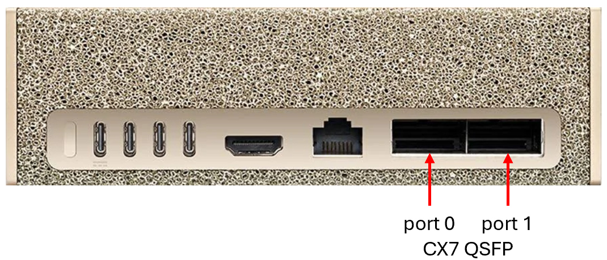

(HostSetupTarget)=

# Host Setup

Holoscan sensor bridge is supported on the following configurations:

- IGX systems configured with
  [IGX OS 1.1.2+](https://developer.nvidia.com/igx-downloads) with CX7 SmartNIC devices.
- AGX Orin systems running [JP6.2.1+](https://developer.nvidia.com/embedded/jetpack). In
  this configuration, the on-board Ethernet controller is used with the Linux kernel
  network stack for data I/O; all network I/O is performed by the CPU without network
  acceleration.
- AGX Thor systems running [JP7.2](https://developer.nvidia.com/embedded/jetpack) with
  MGBE SmartNIC device and CoE transport.
- DGX Spark systems running
  [DGX OS 7.2.3+](https://docs.nvidia.com/dgx/dgx-os-7-user-guide/introduction.html)
  with CX7 SmartNIC devices.
- x86 Linux workstations with an NVIDIA discrete GPU. Two host receive paths are
  supported: unaccelerated Linux socket-based receivers (used primarily for development
  or testing purposes) and an accelerated RoCE path that requires a ConnectX network
  adapter on the link to the sensor bridge. Note that this configuration is not part of
  the primary reference platforms; GPUDirect RDMA into GPU memory on the RoCE path may
  appear available from the GPU and driver even when the PCIe path on the host does not
  support it, in which case you must disable GPU VRAM frame buffers at build time (see
  the **x86 Linux** tab).

After the [Holoscan sensor bridge board is set up](sensor_bridge_hardware_setup.md),
configure a few prerequisites in your host system. While holoscan sensor bridge
demonstration applications usually run in a container, these commands are all to be
executed outside the container, on the host system directly. These configurations are
remembered across power cycles and therefore only need to be set up once.

- Install [git-lfs](https://git-lfs.com)

  Some data files in the Holoscan sensor bridge source repository use GIT LFS.

  ```none
  sudo apt-get update
  sudo apt-get install -y git-lfs
  ```

- Grant your user permission to the docker subsystem:

  ```none
  sudo usermod -aG docker $USER
  ```

  Reboot the computer to activate this setting.

Next, follow the directions on the appropriate tab below to configure your host system.

`````{tab-set}
````{tab-item} IGX

- Determine the name of the network device associated with the first CX7 port. This is
  the rightmost QSFP port when looking at the back of the IGX unit.

  

  ```none
  ls /sys/class/infiniband
  ```
  ```none
  roceP5p3s0f0 roceP5p3s0f1
  ```

  This will produce a list of CX7 ports; your device names may vary. The lowest
  numbered one, in this case `roceP5p3s0f0`, is the first CX7 port.  

  Check the CX7 firmware version using one of the devices names that appear on your machine from the command above. 

  ```
  cat /sys/class/infiniband/roceP5p3s0f0/fw_ver
  ```

  ```
  28.39.3004
  ```

  If the version is 28.38.1026 or lower, please [download](https://developer.nvidia.com/igx-downloads?sortBy=igx_downloads%2Fsort%2Fdate%3Adesc) the appropriate "ConnectX-7 Firmware" iso and [upgrade](https://docs.nvidia.com/igx/user-guide/1.1.1/base-os.html#update-the-connect-x-7-cx7-firmware) the CX7 firmware. Make sure to reboot the machine and re-check the firmware has loaded to the newer one.
  
  Assign the name of the first CX7 port to the variable `$IN0`.

  ```none
  LC_COLLATE=C IN=(/sys/class/infiniband/*)
  IN0=`basename ${IN[0]}`
  echo $IN0
  ```
  ```none
  roceP5p3s0f0
  ```

  Next, determine which host ethernet port is associated with that device, and assign
  that to the variable `$EN0`, which we'll use later during network configuration.

  ```none
  EN0=`basename /sys/class/infiniband/$IN0/device/net/*`
  echo $EN0
  ```
  ```none
  enP5p3s0f0np0
  ```

  In summary, the host network interface associated with `$IN0` (`roceP5p3s0f0`) is
  `$EN0` (`enP5p3s0f0np0`); your specific device names may vary.

- IGX OS uses NetworkManager to configure network interfaces. By default, the sensor
  bridge device uses the address 192.168.0.2 for the first port. Set up your first
  ethernet device (`$EN0`) to use the address 192.168.0.101 with a permanent route
  to 192.168.0.2: ([Here](notes.md#holoscan-sensor-bridge-ip-address-configuration) is more information
  about configuring your system if you cannot use the 192.168.0.0/24 network in this
  way.)

  ```none
  sudo nmcli con add con-name hololink-$EN0 ifname $EN0 type ethernet ip4 192.168.0.101/24
  sudo nmcli connection modify hololink-$EN0 +ipv4.routes 192.168.0.2/32
  sudo nmcli connection modify hololink-$EN0 ethtool.ring-rx 4096
  sudo nmcli connection modify hololink-$EN0 802-3-ethernet.mtu 4096
  sudo nmcli connection up hololink-$EN0
  ```

  Apply power to the sensor bridge device, ensure that it's properly connected, then
  `ping 192.168.0.2` to check connectivity:

  ```none
  ping 192.168.0.2
  PING 192.168.0.2 (192.168.0.2) 56(84) bytes of data.
  64 bytes from 192.168.0.2: icmp_seq=1 ttl=64 time=0.225 ms
  64 bytes from 192.168.0.2: icmp_seq=2 ttl=64 time=0.081 ms
  64 bytes from 192.168.0.2: icmp_seq=3 ttl=64 time=0.088 ms
  64 bytes from 192.168.0.2: icmp_seq=4 ttl=64 time=0.132 ms
  ^C
  --- 192.168.0.2 ping statistics ---
  4 packets transmitted, 4 received, 0% packet loss, time 3057ms
  rtt min/avg/max/mdev = 0.081/0.131/0.225/0.057 ms
  ```

- The second SFP+ connector on the sensor bridge device is used to transmit data
  acquired from the second camera on a stereo camera module (like the IMX274). By
  default, the sensor bridge device uses the address 192.168.0.3 for that second port.
  Connect the second IGX QSFP port (indicated with the red arrow below) to the second
  SFP+ port on the sensor bridge device.

  

  Let's refer to these as `$IN1` and `$EN1`.  Given the commands to assign `$IN0` and
  `$EN0` above,

  ```none
  IN1=`basename ${IN[1]}`
  echo $IN1
  EN1=`basename /sys/class/infiniband/$IN1/device/net/*`
  echo $EN1
  ```
  ```none
  roceP5p3s0f1
  enP5p3s0f1np1
  ```

  As above, your device names may be different.  Configure the second QSFP network port
  with an appropriate address and permanent route:

  ```none
  sudo nmcli con add con-name hololink-$EN1 ifname $EN1 type ethernet ip4 192.168.0.102/24
  sudo nmcli connection modify hololink-$EN1 +ipv4.routes 192.168.0.3/32
  sudo nmcli connection modify hololink-$EN1 ethtool.ring-rx 4096
  sudo nmcli connection modify hololink-$EN1 802-3-ethernet.mtu 4096
  sudo nmcli connection up hololink-$EN1
  ```

  Now test the second connection with `ping 192.168.0.3`:

  ```none
  ping 192.168.0.3
  PING 192.168.0.3 (192.168.0.3) 56(84) bytes of data.
  64 bytes from 192.168.0.3: icmp_seq=1 ttl=64 time=0.210 ms
  64 bytes from 192.168.0.3: icmp_seq=2 ttl=64 time=0.271 ms
  64 bytes from 192.168.0.3: icmp_seq=3 ttl=64 time=0.181 ms
  64 bytes from 192.168.0.3: icmp_seq=4 ttl=64 time=0.310 ms
  64 bytes from 192.168.0.3: icmp_seq=5 ttl=64 time=0.258 ms
  ^C
  --- 192.168.0.3 ping statistics ---
  5 packets transmitted, 5 received, 0% packet loss, time 4102ms
  rtt min/avg/max/mdev = 0.181/0.246/0.310/0.045 ms
  ```

  When the second port is configured, the first port should continue to respond to
  pings as appropriate.

````
````{tab-item} AGX Orin

Demos and examples in this package assume a sensor bridge device is connected to `eno1`,
which is the RJ45 connector on the AGX Orin.

- Configure a static IP address of 192.168.0.101 on the on-board network port.

  L4T uses NetworkManager to configure interfaces; by default interfaces are configured
  as DHCP clients. Use the following command to update the IP address to 192.168.0.101.
  ([Here](notes.md#holoscan-sensor-bridge-ip-address-configuration) is more information
  about configuring your system if you cannot use the 192.168.0.0/24 network in this
  way.)

  Note that for AGX running JP6.2.1, the on-board ethernet device is `eno1`, and for JP7.2, the on-board ethernet device is `end0`; if you're
  running a different configuration, use the appropriate name for the variable EN0:

  ```none
  EN0=end0
  sudo nmcli con add con-name hololink-$EN0 ifname $EN0 type ethernet ip4 192.168.0.101/24
  sudo nmcli connection up hololink-$EN0
  ```

  Apply power to the sensor bridge device, ensure that it's properly connected, then
  `ping 192.168.0.2` to check connectivity.

- For the Linux socket based examples, isolating a processor core from Linux kernel is
  recommended. For high bandwidth applications, like 4k video acquisition, isolation of
  the network receiver core is required. When an example program runs with processor
  affinity set to that isolated core, performance is improved and latency is reduced.
  By default, sensor bridge software runs the time-critical background network receiver
  process on the third processor core. If that core is isolated from Linux scheduling,
  no processes will be scheduled on that core without an explicit request from the
  user, and reliability and performance is greatly improved.

  Isolating that core from Linux can be achieved by editing
  `/boot/extlinux/extlinux.conf`. Add the setting `isolcpus=2` to the end of the line
  that starts with `APPEND`. Your file should look like something like this:

  ```none
  TIMEOUT 30
  DEFAULT primary

  MENU TITLE L4T boot options

  LABEL primary
        MENU LABEL primary kernel
        LINUX /boot/Image
        ...
        APPEND ${cbootargs} ...<other-settings>... isolcpus=2

  ```

  Sensor bridge applications can run the network receiver process on another core by
  setting the environment variable `HOLOLINK_AFFINITY` to the core it should run on.
  For example, to run on the first processor core,

  ```none
  HOLOLINK_AFFINITY=0 python3 examples/linux_imx274_player.py
  ```

  Setting `HOLOLINK_AFFINITY` to blank will skip any core affinity settings in the
  sensor bridge code.

- Run the "jetson_clocks" tool on startup, to set the core clocks to their maximum.

  ```none
  JETSON_CLOCKS_SERVICE=/etc/systemd/system/jetson_clocks.service
  cat <<EOF | sudo tee $JETSON_CLOCKS_SERVICE >/dev/null
  [Unit]
  Description=Jetson Clocks Startup
  After=nvpmodel.service

  [Service]
  Type=oneshot
  ExecStart=/usr/bin/jetson_clocks

  [Install]
  WantedBy=multi-user.target
  EOF
  sudo chmod u+x $JETSON_CLOCKS_SERVICE
  sudo systemctl enable jetson_clocks.service
  ```

- Set the AGX Orin power mode to 'MAXN' for optimal performance. The setting can be
  changed via L4T power drop down setting found on the upper left corner of the screen:

  

- Restart the AGX Orin. This allows core isolation and performance settings to take
  effect. If configuring for 'MAXN' performance doesn't request that you reset the
  unit, then execute the reboot command manually:

  ```none
  reboot
  ```


````
````{tab-item} DGX Spark

- First check for the OTA ConnectX-7 hotplug feature and disable + reboot if present. This disables the NIC if no link is detected which can interfere with these instructions and HSB operation. Note that if your NIC powers down without anything attached, but the file below is not present, you may not have the ability to disable and should update OTA.

```
if [ -f /etc/nvidia/cx7-hotplug-enabled ] ; then
    sudo mv /etc/nvidia/cx7-hotplug-enabled /etc/nvidia/cx7-hotplug-disabled
    sudo reboot
fi
```

- Determine the name of the network device associated with the first CX7 port. This is
  the leftmost QSFP port when looking at the back of the DGX Spark unit ("port 0" in the image below). 
  Note the specific device names `echo`'d below may be different or change depending on the specific 
  system's driver configuration.

  

  ```none
  ls /sys/class/infiniband
  ```
  ```none
  roceP2p1s0f0  roceP2p1s0f1  rocep1s0f0  rocep1s0f1
  ```

  This will produce a list of infiniband devices connected to the CX7 ports; your device names may 
  vary. The lowest numbered one, in this case `roceP2p1s0f0`, is the first CX7 port.  Let's assign
  that name to the variable `$IN0`.

  ```none
  LC_COLLATE=C IN=(/sys/class/infiniband/*)
  IN0=`basename ${IN[0]}`
  echo $IN0
  ```
  ```none
  roceP2p1s0f0
  ```

  Next, determine which host ethernet port is associated with that device, and assign
  that to the variable `$EN0`, which we'll use later during network configuration.

  ```none
  EN0=`basename /sys/class/infiniband/$IN0/device/net/*`
  echo $EN0
  ```
  ```none
  enP2p1s0f0np0
  ```

  In summary, the host network interface associated with `$IN0` (`roceP2p1s0f0`) is
  `$EN0` (`enP2p1s0f0np0`); your specific device names may vary.

- DGX OS uses NetworkManager to configure network interfaces. By default, the sensor
  bridge device uses the address 192.168.0.2 for the first port. Set up your first
  ethernet device (`$EN0`) to use the address 192.168.0.101 with a permanent route
  to 192.168.0.2: ([Here](notes.md#holoscan-sensor-bridge-ip-address-configuration) is more information
  about configuring your system if you cannot use the 192.168.0.0/24 network in this
  way.)

  ```none
  sudo nmcli con add con-name hololink-$EN0 ifname $EN0 type ethernet ip4 192.168.0.101/24
  sudo nmcli connection modify hololink-$EN0 +ipv4.routes 192.168.0.2/32
  sudo nmcli connection modify hololink-$EN0 ethtool.ring-rx 4096
  sudo nmcli connection modify hololink-$EN0 802-3-ethernet.mtu 4096
  sudo nmcli connection up hololink-$EN0
  ```

  Apply power to the sensor bridge device, ensure that it's properly connected, then
  `ping 192.168.0.2` to check connectivity:

  ```none
  ping 192.168.0.2
  PING 192.168.0.2 (192.168.0.2) 56(84) bytes of data.
  64 bytes from 192.168.0.2: icmp_seq=1 ttl=64 time=0.225 ms
  64 bytes from 192.168.0.2: icmp_seq=2 ttl=64 time=0.081 ms
  64 bytes from 192.168.0.2: icmp_seq=3 ttl=64 time=0.088 ms
  64 bytes from 192.168.0.2: icmp_seq=4 ttl=64 time=0.132 ms
  ^C
  --- 192.168.0.2 ping statistics ---
  4 packets transmitted, 4 received, 0% packet loss, time 3057ms
  rtt min/avg/max/mdev = 0.081/0.131/0.225/0.057 ms
  ```

- The second SFP+ connector on the sensor bridge device is used to transmit data
  acquired from the second camera on a stereo camera module (like the IMX274). By
  default, the sensor bridge device uses the address 192.168.0.3 for that second port.
  Connect the second DGX Spark QSFP port ("port 1" in the image above) to the second
  SFP+ port on the sensor bridge device.

  Let's refer to these as `$IN1` and `$EN1`.  Given the commands to assign `$IN0` and
  `$EN0` above,

  ```none
  IN1=`basename ${IN[1]}`
  echo $IN1
  EN1=`basename /sys/class/infiniband/$IN1/device/net/*`
  echo $EN1
  ```
  ```none
  roceP2p1s0f1
  enP2p1s0f1np1
  ```

  As above, your device names may be different.  Configure the second QSFP network port
  with an appropriate address and permanent route:

  ```none
  sudo nmcli con add con-name hololink-$EN1 ifname $EN1 type ethernet ip4 192.168.0.102/24
  sudo nmcli connection modify hololink-$EN1 +ipv4.routes 192.168.0.3/32
  sudo nmcli connection modify hololink-$EN1 ethtool.ring-rx 4096
  sudo nmcli connection modify hololink-$EN1 802-3-ethernet.mtu 4096
  sudo nmcli connection up hololink-$EN1
  ```

  Now test the second connection with `ping 192.168.0.3`:

  ```none
  ping 192.168.0.3
  PING 192.168.0.3 (192.168.0.3) 56(84) bytes of data.
  64 bytes from 192.168.0.3: icmp_seq=1 ttl=64 time=0.210 ms
  64 bytes from 192.168.0.3: icmp_seq=2 ttl=64 time=0.271 ms
  64 bytes from 192.168.0.3: icmp_seq=3 ttl=64 time=0.181 ms
  64 bytes from 192.168.0.3: icmp_seq=4 ttl=64 time=0.310 ms
  64 bytes from 192.168.0.3: icmp_seq=5 ttl=64 time=0.258 ms
  ^C
  --- 192.168.0.3 ping statistics ---
  5 packets transmitted, 5 received, 0% packet loss, time 4102ms
  rtt min/avg/max/mdev = 0.181/0.246/0.310/0.045 ms
  ```

  When the second port is configured, the first port should continue to respond to
  pings as appropriate.

````
````{tab-item} AGX Thor
  
- After installing JP 7.2 on the Thor devkit, complete the following steps.

  If installation was done using the ISO method, install [CUDA Toolkit 13.2](https://developer.nvidia.com/cuda-downloads?target_os=Linux&target_arch=arm64-sbsa&Compilation=Native&Distribution=Ubuntu&target_version=24.04&target_type=deb_local) and execute the following:

  ```none
  export PATH=/usr/local/cuda/bin:$PATH
  export LD_LIBRARY_PATH=/usr/local/cuda/lib64:$LD_LIBRARY_PATH
  wget https://developer.nvidia.com/downloads/embedded/L4T/r39_Release_v2.0/release/Jetson_SIPL_API_R39.2.0_aarch64.tbz2
  wget https://developer.nvidia.com/downloads/embedded/L4T/r39_Release_v2.0/release/Jetson_Multimedia_API_R39.2.0_aarch64.tbz2
  sudo tar xjf Jetson_SIPL_API_R39.2.0_aarch64.tbz2 -C /
  sudo tar xjf Jetson_Multimedia_API_R39.2.0_aarch64.tbz2 -C /
  ```

- For the Linux socket based examples, isolating a processor core from Linux kernel is
  recommended. For high bandwidth applications, like 4k video acquisition, isolation of
  the network receiver core is required. When an example program runs with processor
  affinity set to that isolated core, performance is improved and latency is reduced.
  By default, sensor bridge software runs the time-critical background network receiver
  process on the third processor core. If that core is isolated from Linux scheduling,
  no processes will be scheduled on that core without an explicit request from the
  user, and reliability and performance is greatly improved.

  Isolating that core from Linux can be achieved by editing
  `/boot/extlinux/extlinux.conf`. Add the setting `isolcpus=2` to the end of the line
  that starts with `APPEND`. Your file should look like something like this:

  ```none
  TIMEOUT 30
  DEFAULT primary

  MENU TITLE L4T boot options

  LABEL primary
        MENU LABEL primary kernel
        LINUX /boot/Image
        ...
        APPEND ${cbootargs} ...<other-settings>... isolcpus=2

  ```

  Sensor bridge applications can run the network receiver process on another core by
  setting the environment variable `HOLOLINK_AFFINITY` to the core it should run on.
  For example, to run on the first processor core,

  ```none
  HOLOLINK_AFFINITY=0 python3 examples/linux_imx274_player.py
  ```

  Setting `HOLOLINK_AFFINITY` to blank will skip any core affinity settings in the
  sensor bridge code.

  **This step requires a system reboot to take effect.**

- Install Holoscan SDK v4.2.0:

  ```none
  sudo apt update
  sudo apt install holoscan-cuda-13=4.2*
  ```

- Install other Holoscan sensor bridge dependencies:

  ```none
  . /etc/os-release
  UBUNTU_VERSION="`echo ${VERSION_ID} | sed 's/\.//g'`"
  sudo apt-get install ca-certificates gpg wget
  wget https://developer.download.nvidia.com/compute/nvcomp/5.2.0/local_installers/nvcomp-local-repo-ubuntu${UBUNTU_VERSION}-5.2.0_5.2.0-1_arm64.deb
  sudo dpkg -i nvcomp-local-repo-ubuntu${UBUNTU_VERSION}-5.2.0_5.2.0-1_arm64.deb
  sudo cp /var/nvcomp-local-repo-ubuntu${UBUNTU_VERSION}-5.2.0/nvcomp-*-keyring.gpg /usr/share/keyrings/
  rm nvcomp-local-repo-ubuntu${UBUNTU_VERSION}-5.2.0_5.2.0-1_arm64.deb
  test -f /usr/share/doc/kitware-archive-keyring/copyright ||
  wget -O - https://apt.kitware.com/keys/kitware-archive-latest.asc 2>/dev/null | gpg --dearmor - | sudo tee /usr/share/keyrings/kitware-archive-keyring.gpg >/dev/null
  echo "deb [signed-by=/usr/share/keyrings/kitware-archive-keyring.gpg] https://apt.kitware.com/ubuntu/ ${VERSION_CODENAME} main" | sudo tee /etc/apt/sources.list.d/kitware.list >/dev/null
  sudo apt-get update
  test -f /usr/share/doc/kitware-archive-keyring/copyright ||
  sudo rm /usr/share/keyrings/kitware-archive-keyring.gpg
  sudo apt-get install kitware-archive-keyring
  sudo apt-get update
  sudo apt install -y cmake=3.31.11* cmake-data=3.31.11* libfmt-dev libssl-dev libcurlpp-dev libyaml-cpp-dev python3-dev nvcomp-cuda-13
  ```

- Enable the network interface and ensure that the camera enumerates (assumes camera IP address 192.168.0.2):

  ```none
  EN0=mgbe0_0
  sudo nmcli con add con-name hololink-$EN0 ifname $EN0 type ethernet ip4 192.168.0.101/24
  sudo nmcli connection modify hololink-$EN0 +ipv4.routes 192.168.0.2/32
  sudo nmcli connection up hololink-$EN0
  ```

- Obtain and build holoscan sensor bridge:

  holoscan sensor bridge release v2.6 supports running C++ Li VB1940 accelerated networking based examples 
  from the terminal cli as well as running Li VB1940 and IMX274 python examples from within the
  holoscan sensor bridge container.
  
  as a first step, please clone the holoscan sensor bridge repository: 

  ```none
  git clone https://github.com/nvidia-holoscan/holoscan-sensor-bridge.git
  ```

  to run C++ Li VB1940 accelerated networking SIPL based examples in the terminal cli
  use the following commands:

  ```none
  cd holoscan-sensor-bridge
  mkdir build && cd build
  cmake -DHOLOLINK_BUILD_SIPL=1 -DHOLOLINK_BUILD_FUSA=1 -DHOLOLINK_BUILD_ROCE=0 ..
  make -j
  ```

<b> Running the CoE-Accelerated Examples </b>

Thor's hardware-accelerated CoE capabilities can be leveraged by Holoscan Sensor Bridge
using one of two different paths outlined below.

<b> SIPL </b>

[SIPL](https://docs.nvidia.com/jetson/archives/r39.2/DeveloperGuide/SD/CameraDevelopment/SIPLFramework/Introduction-to-SIPL.html)
is a modular, extensible framework for image sensor control and image processing that
exposes the full hardware capabilities of Thor including CoE and ISP hardware
acceleration. SIPL-enabled sensor drivers are written using the
[Unified Device Driver Framework (UDDF)](uddf_drivers.md), and reference VB1940 UDDF
drivers are included with JetPack 7.2.

Use the following to run the SIPL-based CoE example applications for the VB1940 sensor:

- Retrieve your camera's MAC ID:

  ```none
  ./tools/enumerate/hololink-enumerate
  ```

  Example output:

  ```none
  mac_id=8C:1F:64:6D:70:03 hsb_ip_version=0x2510 fpga_crc=0xffff ip_address=192.168.0.2 fpga_uuid=f1627640-b4dc-48af-a360-c55b09b3d230 serial_number=ffffffffffffff interface=mgbe0_0 board=Leopard Eagle
  ```

- Update the `ip_address` and `mac_address` fields in these configuration files (multiple instances in each file):

  **NOTE:** The provided JSON `sipl_config` files are compatible with JP7.2. For JP7.1, pull the source files from the [HSB 2.5.0 release](https://github.com/nvidia-holoscan/holoscan-sensor-bridge/tree/2.5.0/examples/sipl_config) and make necessary modifications to them.

  ```none
  ../examples/sipl_config/vb1940_single.json
  ../examples/sipl_config/vb1940_dual.json
  ```

- Allow root to access the X display (ensure `DISPLAY` is set if using SSH):

  ```none
  xhost +
  ```

- Run the `sipl_player` application (HW ISP capture mode):

  ```none
  ./examples/sipl_player --json-config ../examples/sipl_config/vb1940_single.json
  ./examples/sipl_player --json-config ../examples/sipl_config/vb1940_dual.json
  ```

- For RAW capture mode (image quality will be poor without proper ISP processing):

  ```none
  ./examples/sipl_player --json-config ../examples/sipl_config/vb1940_single.json --raw
  ./examples/sipl_player --json-config ../examples/sipl_config/vb1940_dual.json --raw
  ```

<b>FuSa</b>

FuSa is a new API included with JetPack 7.1+ which exposes access to Thor's CoE data
capture path without providing the additional camera control and ISP access that is
offered by SIPL. This allows applications direct control of the Holoscan Sensor Bridge
and attached sensors in a CoE-accelerated environment, bypassing the need for SIPL and
its UDDF driver implementations. This enables applications to follow a more traditional
Holoscan Sensor Bridge implementation where the sensor control is managed directly by
the application instead of by external drivers. Because of this, FuSa example
applications exist for both the IMX274 and VB1940 sensors using the existing reference
drivers provided by Holoscan Sensor Bridge.

A number of FuSa-based example applications are included for the IMX274 and VB1940 using
the `fusa-coe` prefix. The C++ sample applications can be run natively (not using a
container) and are built by the host setup instructions above, while the Python variants
must be run using the [Holoscan Sensor Bridge container](build.md).

  **NOTE:** The `python/setup.py` will by default not enable the necessary FuSa or SIPL components unless it detects the required /dev/coe* devices or the `COE_OFFLOAD` environment variable is set. No action is required in the provided docker container or in native python binding builds on supported platforms.

For example, to run the C++ VB1940 player example, run the following command with the IP
address replaced with the IP address of the device:

```none
./examples/fusa_coe_vb1940_player --hololink 192.168.0.2
```

- Building and running Li VB1940 and IMX274 python examples from within the holoscan sensor bridge container
  is explained in the following pages of the user guide.

````
````{tab-item} x86 Linux

Use this tab when the host is an x86 PC running Linux with an NVIDIA discrete GPU.

**Capture paths on x86**

- **Socket-based receiver** — The standard Linux network stack path used by examples
  whose names are prefixed with `linux_` (for example `linux_imx274_player`). This does
  not require a ConnectX adapter; use whichever Ethernet interface reaches the sensor
  bridge and follow the same IP and [PTP](ptp.md) guidance as for other hosts. Note that
  this path is not accelerated, and so is often unable to keep up with the data rates
  required to stream typical sensor (e.g. camera) data, leading to intermittent data loss.
  This path is primarily meant for development purposes.

- **RoCE-accelerated receiver** — Uses RDMA over Converged Ethernet to the sensor bridge
  and requires a Mellanox/NVIDIA ConnectX adapter on that link. The interface setup
  requirements (i.e. addresses, routes, ring buffers, MTU) match IGX or DGX Spark:
  the sensor bridge must be reachable at its assigned address (e.g. `192.168.0.2`) using
  the same scheme as in the **IGX** or **DGX Spark** tabs above (adapt device names such
  as `$IN0`, `$EN0` to your system).

(gpudirect-rdma-on-the-roce-path)=
**GPUDirect RDMA on the RoCE path**

Using RoCE with GPUDirect RDMA into GPU memory requires the following:

- A workstation-class NVIDIA GPU (consumer and mobile GPUs do not support GPUDirect
  RDMA).
- The NVIDIA open kernel driver packages on the host (e.g. `nvidia-driver-open`).
- A PCIe topology where the ConnectX NIC and the GPU are peers such that the NIC
  can perform RDMA directly to the GPU (platform firmware, root-port layout, and
  IOMMU settings must allow this end-to-end).

When these requirements are met, frame buffers can reside in GPU memory and data received
from the sensor bridge can be written via RDMA directly to GPU memory. When the GPU and
driver support GPUDirect registration but the host PCIe system path does not actually
deliver RDMA writes into that memory, data received from the sensor bridge will not actually
be written to the GPU memory and will typically result in incorrect data (e.g. black/blank
image frames) and/or metadata mismatch errors. If this is the case, the build must be
configured to force the use of pinned host memory instead (see next section).

**Demo container on x86**

Install Docker, Docker Buildx, and the
[NVIDIA Container Toolkit](https://docs.nvidia.com/datacenter/cloud-native/container-toolkit/latest/install-guide.html)
on the host. Build the demo image with the dGPU option (see [build instructions](build.md)):

```none
sh docker/build.sh --dgpu
```

**When GPUDirect RDMA does not work end-to-end**

It may be the case that RoCE RDMA looks healthy while RDMA writes into registered GPU
memory do not actually succeed; for example, when the GPU supports GPUDirect but the PCIe
configuration does not allow the ConnectX NIC to reach the GPU as an RDMA peer. Symptoms
include a black or blank image and application log lines similar to:

```none
ERROR 6.6634 roce_receiver.cpp:826 get_next_frame tid=0x61 -- Metadata psn=0 but received_psn=483318.
```

This is a strong indication to rebuild with GPU VRAM disabled so the RoCE receiver uses
pinned host memory instead:

- **Demo container:** pass `--disable-roce-gpu-vram` to `docker/build.sh` (together with
  `--dgpu` as usual) to build the image. Example:

  ```none
  sh docker/build.sh --dgpu --disable-roce-gpu-vram
  ```

- **Native CMake build:** configure with:

  ```none
  -DHOLOLINK_ROCE_USE_GPU_VRAM=OFF
  ```

Using pinned host memory instead of GPU VRAM enables a partly accelerated path: the
NIC will still RDMA directly to the system memory using RoCE, bypassing the Linux
networking subsystem, but this data will then need to be transferred across PCIe
when the GPU later reads the data.

When the [GPUDirect RDMA requirements](gpudirect-rdma-on-the-roce-path) are satisfied
on your machine, the default build keeps `HOLOLINK_ROCE_USE_GPU_VRAM` on and the fully
accelerated GPUDirect RDMA path can be used. Internally, this path has been validated
on an AMD Threadripper-based Lenovo ThinkStation workstation with a ConnectX-6 Dx
network adapter and Quadro RTX 6000 GPU.

````
`````

Now, for all configurations,

- Configure the network receiver buffer for running unaccelerated network examples:
  Holoscan sensor bridge supports running Li VB1940 and IMX274 using unaccelerated
  network Linux sockets. For best performance of these examples increase the Linux
  sockets network receiver buffer:

  ```none
  echo 'net.core.rmem_max = 31326208' | sudo tee /etc/sysctl.d/52-hololink-rmem_max.conf
  sudo sysctl -p /etc/sysctl.d/52-hololink-rmem_max.conf
  ```

- Make sure that $EN0 is set to the name of the Ethernet controller connected to HSB.
  Some installations require reboots which will clear this value, so be sure and
  configure it appropriately for your configuration per the instructions above.

- Enable PTP on $EN0. This synchronizes the timestamps reported with received data with
  the host time.

  Run the `phc2sys` tool at boot time. This synchronizes the clock in $EN0 with the
  system clock. First, install the `linuxptp` tool.

  ```none
  sudo apt update && sudo apt install -y linuxptp
  ```

  Next, set up a systemd service file that will run `phc2sys`.

  ```none
  PHC2SYS_SERVICE=/etc/systemd/system/phc2sys-$EN0.service
  cat <<EOF | sudo tee $PHC2SYS_SERVICE >/dev/null
  [Unit]
  Description=Copy system time to $EN0
  Requires=NetworkManager.service
  After=NetworkManager.service
  After=timemaster.service

  [Service]
  Type=simple
  ExecStartPre=timeout 3m bash -c "until [ \"\$(nmcli -g GENERAL.STATE device show $EN0)\" = \"100 (connected)\" ]; do sleep 1; done"
  ExecStart=/usr/sbin/phc2sys -c $EN0 -s CLOCK_REALTIME -O 0 -S 0.0001

  [Install]
  WantedBy=multi-user.target
  EOF
  ```

  Configure it for execution at startup, and start it now.

  ```none
  sudo chmod u+x $PHC2SYS_SERVICE
  sudo systemctl enable phc2sys-$EN0.service
  sudo systemctl start phc2sys-$EN0.service
  ```

  Next, run `ptp4l` to send PTP SYNC messages to $EN0.

  ```none
  cat <<EOF | sudo tee /etc/linuxptp/hsb-ptp.conf >/dev/null
  # This configuration is appropriate for NVIDIA Holoscan sensor bridge
  # applications, where PTP messages are sent over L2 and a 1/2 second interval.
  [global]
  logSyncInterval -1
  logMinDelayReqInterval -1
  network_transport L2
  EOF
  ```

  Set up a systemd service file for this.

  ```none
  PTP4L_SERVICE=/etc/systemd/system/ptp4l-$EN0.service
  cat <<EOF | sudo tee $PTP4L_SERVICE >/dev/null
  [Unit]
  Description=Send PTP SYNC messages to $EN0
  After=phc2sys-$EN0.service

  [Service]
  Type=simple
  ExecStart=/usr/sbin/ptp4l -i $EN0 -f /etc/linuxptp/hsb-ptp.conf

  [Install]
  WantedBy=multi-user.target
  EOF
  ```

  Finally, run it.

  ```none
  sudo chmod u+x $PTP4L_SERVICE
  sudo systemctl enable ptp4l-$EN0.service
  sudo systemctl start ptp4l-$EN0.service
  ```

- For Orin iGPU with Cuda 12 configurations only (Jetpack 6 and IGX 1.X): Install
  [NVIDIA DLA](https://developer.nvidia.com/deep-learning-accelerator) compiler.
  Applications using inference need this at initialization time; some OS images for iGPU
  don't include it.

  ```none
  sudo apt update && sudo apt install -y nvidia-l4t-dla-compiler
  ```

- Log in to Nvidia GPU Cloud (NGC) with your developer account:

  - If you don't have a developer account for NGC please register at
    [https://catalog.ngc.nvidia.com/](https://catalog.ngc.nvidia.com/)

  - Create an API key for your account:
    [https://ngc.nvidia.com/setup/api-key](https://ngc.nvidia.com/setup/api-key)

  - Use your API key to log in to nvcr.io:

    ```none
    docker login nvcr.io
    Username: $oauthtoken
    Password: <Your token key to NGC>
    WARNING! Your password will be stored unencrypted in /home/<user>/.docker/config.json.
    Configure a credential helper to remove this warning. See
    https://docs.docker.com/engine/reference/commandline/login/#credentials-store

    Login Succeeded
    ```

Now proceed to [build and test the Holoscan Sensor Bridge container](build.md).
